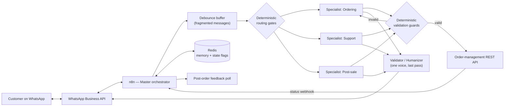

# Yasmin — AI Ordering Agent for WhatsApp

**English** · [Português (BR)](README.pt-BR.md)

> Case study / portfolio writeup. This repo documents the architecture and the real engineering
> problems solved while building and hardening a production AI agent that takes food orders over
> WhatsApp. Client name, vendor name, phone numbers, and credentials have been removed or
> genericized — the architecture, bugs, evidence, and fixes described here are real and
> unmodified.

**At a glance**

- **In production**, taking real orders — roughly **100 orders every two days**, no human in the loop for the common case.
- **12 deterministic guards** sit between the LLM and the money. [The code is here](guards/order-validation.js).
- Root-caused a **silent failure that had run for months** — order-status lookup that never worked, written off as vendor flakiness. One unwired branch.
- Reverse-engineered **three undocumented vendor API behaviours**, including the one that made the model emit product IDs that looked real.
- Tested credential and network failures against the **real** endpoints, on an isolated clone, without touching live service.

## What it does

A customer messages a restaurant's WhatsApp number. An AI agent ("Yasmin") reads the menu,
answers questions, builds an order — combos, add-ons, drinks, delivery address, payment method,
cash change — and creates that order in the restaurant's order-management system, with no human
in the loop for the common case. It also pushes delivery-status updates and runs a post-order
feedback flow.

This is not a chatbot demo. It moves real money and real food orders for real customers, which
changes what "good enough" means: a hallucinated product ID, an unconfirmed choice, or a delivery
fee that silently falls back to the wrong zone isn't a cosmetic bug — it's a wrong order or lost
revenue.

## Architecture



Two architectural rules the whole system is built on:

**1. Thin orchestrator, specialist sub-workflows, one voice at the end.** The Master routes; each
specialist owns one domain and its own tools; a final Validator rewrites every outgoing message
into a single consistent voice. *Logic lives in the specialist, voice lives in the Validator* —
which means a tone change never risks breaking order logic, and vice versa.

**2. Anything touching money or a promise to the customer is deterministic code, never a prompt.**
This is the rule that most of this writeup is about. It wasn't a design principle at the start; it
was learned, expensively, from the failures below.

## Keeping an LLM honest in production

Prompt engineering gets an agent working in a demo. It does not reliably get an agent working
when real customers type real, messy, fragmented, ambiguous things at 11pm on a Friday.

The operating heuristic that came out of this project: **when a behavior fails twice for the same
reason after a prompt fix, stop editing the prompt.** A second failure is evidence that the cause
isn't in the prompt at all.

### 1. The model invented product IDs — the reason was hiding in an undocumented field

Order creation started intermittently failing with a generic `500` from the vendor API. The agent
was sometimes sending a numeric product ID for a combo that didn't exist anywhere in the menu.

The lazy fix is "tell the model harder, in the prompt, to only use real IDs." That had already
been tried — twice — with no improvement.

Root cause, found by diffing the raw menu API response against what the agent actually saw: the
vendor's menu endpoint returns, for every add-on group, an internal `product_id` used for their
own POS integration. That field is stripped before the agent sees it — but its numeric *format*
is identical to real, orderable product IDs. The model was generalizing the wrong numeric pattern
and occasionally landing on one of those internal IDs, which do exist in the vendor's system for
something unrelated, so the API's validation didn't reject them the way it rejects a made-up
number.

**Fix:** not a longer prompt. A guard that re-fetches the live menu and validates every ID
*before* the order is submitted, rejecting with a structured error the agent can act on.

```js
const freshMenu = await this.helpers.httpRequest({ method: 'GET', url: menuEndpoint, headers, json: true });
const validGeneralIds = new Set(freshMenu.general.flatMap(cat => cat.products.map(p => Number(p.id))));
const validComboIds  = new Set(freshMenu.combos.map(c => Number(c.id)));

const invalidItem = orderItems.find(item => {
  const id = Number(item.id);
  return item.type === 'combo' ? !validComboIds.has(id) : !validGeneralIds.has(id);
});

if (invalidItem) {
  return [{ json: { error: 'order_creation_failed', detail: `invalid id ${invalidItem.id}` } }];
}
```

### 2. Requiring a field does not prove the question was asked

Card payments need to be marked credit or debit. The tool schema required a `cardMethod` field,
and the prompt instructed the agent to ask the customer before filling it.

An order went out marked `credit` for a customer who had said "debit." The agent had never asked —
it filled the required field with a plausible value, because **a required field is a prompt for
the model, not a proof of anything.** Requiring data does not cause the question to be asked.

**Fix — the generalizable one.** The value the model sends is *ignored entirely*. The method is
derived from the customer's own message, mapped into the workflow through a fixed expression
rather than a model-populated argument, so the agent cannot forge it:

```js
const customerSaid = normalize(input.customerMessage);       // fixed mapping, not model-supplied
const saidCredit = customerSaid.includes('credito');
const saidDebit  = customerSaid.includes('debito');

if (!saidCredit && !saidDebit) {
  return reject('card payment without knowing credit or debit — the customer has not answered ' +
                'yet. Ask, WAIT for the reply, then call create_order again.');
}
payments.forEach(p => { if (p.paymentType === 'creditCard') p.cardMethod = saidDebit ? 'debit' : 'credit'; });
```

The principle it generalizes to, and the one I now apply by default: **proof of a conversational
event has to be external to the model** — a flag written by the flow itself, or the customer's raw
message matched by a fixed mapping. Never the model's own report that it asked.

The same shape guards a second case: the agent could create an order without ever having asked
delivery-vs-pickup. The flow writes a `delivery_asked:{phone}` key in Redis only when the outgoing
message actually contains that question; order creation refuses to proceed without it.

### 3. The agent announced orders that were never created

The agent occasionally told a customer "order confirmed!" when the order-creation tool had never
succeeded — or never been called. The customer waits for food that no kitchen knows about. That's
worse than an error message.

**Fix:** a node between the specialist and the customer that cross-checks the outgoing text
against real state. Order creation writes a short-TTL key when — and only when — the vendor API
returns success. If the outgoing message announces a confirmed order and that key doesn't exist,
the message is *replaced* before it is ever sent. It has caught a live one.

This is the same idea as the guards above, pointed at the last mile: the model does not get to be
the source of truth about whether something happened.

### 4. Routing that depended on a classifier's guess

The post-order feedback poll offers Excellent / Good / Bad. Tapping **Bad** worked. Tapping
**Good** made the agent greet the customer as if the conversation had just started.

Root cause, from the conversation log: with no active order flag and no pending-complaint flag,
the message fell through to an LLM classifier, which read the bare word "Good" and classified it
as a greeting. "Bad" *reads* like a complaint to a classifier; "Good" reads like "good morning."
**The routing of a real business event was resting on a model's guess about an ambiguous word.**

**Fix:** an exact-match deterministic gate ahead of the classifier — if the customer's whole
message, stripped of injected context lines and normalized, is exactly one of the three grades, it
routes to post-sale. "good morning" and "sounds good" don't match; only the bare word a button tap
produces.

The same fix closed a race nobody had hit yet: if an order completes inside the active-order TTL
window, the tap would have been swallowed by the ordering specialist instead. Both gates were
changed together.

## Reverse-engineering an undocumented vendor API

Public docs covered maybe half of what shipping this actually required. The rest came from support
tickets, controlled experiments, and reading what real orders recorded.

### The vendor recalculates the total — the totals you send are ignored

The order payload has a `total` field and a `deliveryFee` field. Both are accepted, and both are
silently discarded. The vendor recomputes:

```
total         = sum of items, priced from THEIR catalog
totalNetValue = total + deliveryFee
deliveryFee   = the fee of the delivery zone referenced by deliveryFeeID
```

Two real orders established this, one field at a time:

| order | what we sent | what the vendor recorded |
|---|---|---|
| A | `total = 37` (32 items + 2 fee + 3 surcharge) | `total: 32, deliveryFee: 2, totalNetValue: 34` |
| B | `deliveryFee = 5` | `total: 29, deliveryFee: 2, totalNetValue: 31` |

Order A closed the `total` field. Order B closed `deliveryFee`. The practical consequence is
sharp: **there is no field that can carry a surcharge.** Money enters an order through exactly two
doors — the items, or the zone record. Anything else is a number the vendor throws away, and a
"working" fix that silently charges the wrong amount is worse than a visible failure.

### A delivery surcharge with nowhere to live

Two outlying neighborhoods needed to cost more than the default zone. Per the above, that means
they must exist as zone records — but the vendor's zone form is backed by a geocoder that only
accepts neighborhoods present in its address database, and neither of these informal local names
exists there. Creating the zone through the API returned a server-side `500` with no field-level
detail.

**Fix:** decouple the *billing zone* from the *delivery locality*. A nearby neighborhood that the
geocoder does recognize is registered at the correct price and used purely as a billing label; the
lookup sends that label and gets the right fee and zone ID natively. The real locality — the one
the customer said and the driver needs — is carried in the order note:

```
DELIVERY TO VILA NOVA (BILLED AS <registered zone>)
```

Two names, two jobs. Unifying them "to simplify" breaks one side or the other: send the real
locality to the pricing API and it falls back to the cheap default zone; write the billing label
on the ticket and the driver goes to the wrong place. The code comments say exactly that, because
the next person to read it will be tempted.

The fallback matters as much as the happy path: if the lookup fails, the order still completes at
the default fee with an explicit `ZONE NOT REGISTERED — MANUAL SURCHARGE` note. **No order ever
breaks because a pricing lookup did.**

### The change field that wasn't the change field

Cash orders were reaching the kitchen with the change amount at zero — drivers left without
knowing whether they needed change. The payload was sending `change` and `changeFor`; the field
the vendor actually reads is **`changeValue`, nested inside the payment object**, and the
unrecognized keys were accepted and ignored rather than rejected.

This is the failure mode that makes undocumented APIs expensive: **the wrong field name doesn't
error, it just quietly does nothing.** Every field in the payload is now either confirmed by a
real order's recorded output or explicitly marked as unverified in a comment.

## The guard catalogue

Every guard exists because of a specific incident. They live in one validation node that runs
before any order reaches the vendor — **[the code is in `guards/`](guards/order-validation.js)**,
redacted but structurally unmodified.

| Guard | What it blocks | The incident that created it |
|---|---|---|
| Delivery type has no default | Empty or invalid value | An order silently became counter-pickup |
| `delivery_asked` flag required | Ordering without having asked delivery vs. pickup | Order created from a conversation where it was never asked |
| `order_created` lock | Two orders from one confirmation | Double-charged customer |
| Item JSON shape (4 separate checks) | Malformed payload | Broken JSON reached the API as a generic 500 |
| JSON repair pass | One trailing brace | A single stray character killed a real order |
| Invalid item ID | ID outside the live menu | The undocumented-field story above |
| Add-on group mismatch | Add-on ID from another product's group | `400 Extra does not belong to combo` |
| Drink validation | Drink note that matches no available can | A combo shipped with a drink nobody chose |
| Payment type whitelist | Portuguese words, and one plausible-but-nonexistent card type | Three separate `400`s |
| Credit/debit from the customer's words | The model inventing the card method | Wrong method on a real order |
| Change amount sanity | "Needs change" with a value at or below the total | Change that cannot exist |
| False-confirmation interceptor | Announcing an order that was never created | Caught live |

The pattern worth extracting: each guard **rejects with an instruction, not an error code.** The
agent receives "the customer hasn't answered yet — ask, wait, then call again," which it can act
on, instead of a stack trace it will paraphrase badly to the customer.

## Finding a silent failure by auditing, not guessing

Order-status lookup had apparently never worked for normal, non-canceled orders — for as long as
anyone remembered. It was written off as vendor flakiness and worked around with retries and human
escalation.

Root cause: an `IF` node with two branches, "canceled/scheduled" and "everything else." Only the
first was wired to anything. The second — the one that fires for the overwhelming majority of real
orders — connected to nothing. The sub-workflow simply stopped, silently.

It was found by systematically re-reading every node's connections against what the tool was
supposed to return, because every other explanation had been ruled out with evidence. The fix was
one missing connection; the investigation was the work.

This produced a rule the whole project now runs on: **the signal that counts is external state.**
Not the agent saying it registered a complaint — the row in the database. Not "order confirmed" —
the order in the vendor's panel. Agents report success they didn't achieve; systems of record
don't.

## Testing failure modes without touching production

Two tools depend on external APIs. I needed to know what happens when those calls genuinely fail —
not what should happen in theory.

Corrupting the real credential to test this was rejected on purpose: it's shared across the entire
restaurant, so breaking it even briefly degrades every real customer messaging in at that moment.

Instead: a complete clone of the production workflow on a different, private webhook path, with
the credential or target host swapped for something guaranteed to fail. Same agent, same prompt,
same tool-calling, zero shared blast radius.

- Invalid credential → real `401` from the real endpoint, caught cleanly, customer gets a normal
  response, no stack trace, no silent hang.
- Unreachable host (real TCP failure, not a mock) → same graceful handling.

## A platform quirk, found by isolation

Applying a large update to the always-on production workflow started failing with a generic `500`
and an empty body.

Rather than guessing, I isolated one variable at a time: pushed a byte-identical clone of the
entire workflow as a new *inactive* workflow — it saved instantly. That ruled out payload size and
node complexity in one move. The only remaining difference was that the target workflow was active
with its webhook live at the moment of the write. Deactivate before writing, reactivate after —
fixed completely, and now a hard rule for this workflow. Not documented anywhere publicly; found
with a controlled experiment.

## Limitations and what I'd do differently

Honest notes, because a case study that only lists wins isn't useful:

- **Vendor tokens started life hardcoded** in workflow parameters instead of the platform's
  credential store. It works and is scoped to a dev environment, but it's the first thing I'd move.
- **The billing-zone indirection is a workaround, not a solution.** The right fix is a vendor-side
  zone record with the real neighborhood name; the support ticket for it is open. The code is
  written to switch over with no changes the day it lands.
- **Some guards would be better as schema validation** at the tool boundary rather than as
  imperative checks inside one large node. That node is now the single biggest thing in the
  project and wants splitting.
- **Test coverage is manual and scenario-based** — a real order, a real tap, a real dump read
  afterward. It caught everything here, but it doesn't scale and doesn't run in CI.

## Stack

n8n (orchestration) · OpenAI, function-calling agents · Redis (short-term memory, TTL state flags)
· PostgreSQL (conversation history and feedback; was the memory store before Redis, migrated once
it was clear the data was ephemeral by design) · REST APIs · WhatsApp Business API webhooks

## Status

In production, handling roughly 100 real orders every two days, end-to-end: menu browsing, combos with add-ons,
delivery and pickup, cash / card / instant-transfer payment including change, zone-based delivery
pricing, delivery-status push notifications, and post-order feedback collection.

---

**João Paulo Lomba** — AI Engineer & Full Stack Developer
[GitHub](https://github.com/joaolombabr) · [LinkedIn](https://www.linkedin.com/in/joaolombadev/)
