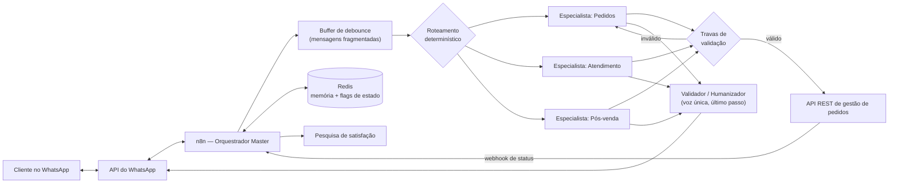

# Yasmin — Agente de IA para Pedidos via WhatsApp

[English](README.md) · **Português (BR)**

> Estudo de caso / portfólio. Este repositório documenta a arquitetura e os problemas reais de
> engenharia resolvidos ao construir e endurecer um agente de IA em produção que recebe pedidos
> de comida pelo WhatsApp. Nome do cliente, nome do fornecedor, telefones e credenciais foram
> removidos ou generalizados — a arquitetura, os bugs, as evidências e as correções descritos
> aqui são reais e não foram alterados.

**Resumo rápido**

- **Em produção**, recebendo pedidos reais — cerca de **100 pedidos a cada dois dias**, sem humano no meio no caso comum.
- **12 guardas determinísticas** entre o LLM e o dinheiro. [O código está aqui](guards/order-validation.js).
- Causa raiz de uma **falha silenciosa que durava meses** — consulta de status que nunca funcionou, atribuída a instabilidade do fornecedor. Uma ramificação sem ligação.
- Engenharia reversa de **três comportamentos não documentados da API** do fornecedor, incluindo o que fazia o modelo emitir IDs de produto que pareciam reais.
- Testes de falha de credencial e de rede contra os endpoints **reais**, em clone isolado, sem tocar no atendimento ao vivo.

## O que faz

Um cliente manda mensagem para o WhatsApp de uma hamburgueria. Um agente de IA ("Yasmin") lê o
cardápio, responde dúvidas, monta o pedido — combos, adicionais, bebida, endereço de entrega,
forma de pagamento, troco — e cria esse pedido no sistema de gestão da loja, sem humano no meio
no caso comum. Também envia atualizações de status da entrega e conduz a pesquisa de satisfação
depois do pedido.

Não é uma demo de chatbot. Ele move dinheiro e pedidos de clientes reais, o que muda o
significado de "bom o suficiente": um ID de produto alucinado, uma escolha não confirmada ou uma
taxa de entrega que cai silenciosamente na zona errada não são bugs cosméticos — são pedido
errado ou receita perdida.

## Arquitetura



Duas regras de arquitetura sustentam o sistema inteiro:

**1. Orquestrador fino, sub-workflows especialistas, uma voz no fim.** O Master roteia; cada
especialista é dono de um domínio e das próprias ferramentas; um Validador final reescreve toda
mensagem de saída numa voz consistente. *A lógica mora no especialista, a voz mora no Validador* —
assim uma mudança de tom nunca arrisca quebrar a lógica de pedido, e vice-versa.

**2. Tudo que envolve dinheiro ou promessa ao cliente é código determinístico, nunca prompt.**
É sobre essa regra que a maior parte deste texto trata. Ela não era um princípio de projeto no
começo; foi aprendida, caro, com as falhas abaixo.

## Mantendo um LLM honesto em produção

Engenharia de prompt faz um agente funcionar numa demo. Ela não faz um agente funcionar de forma
confiável quando clientes reais digitam coisas reais, bagunçadas, fragmentadas e ambíguas às 23h
de uma sexta.

A heurística que saiu deste projeto: **quando um comportamento falha duas vezes pelo mesmo motivo
depois de uma correção de prompt, pare de editar o prompt.** A segunda falha é evidência de que a
causa não está no prompt.

### 1. O modelo inventava IDs de produto — e a razão estava num campo não documentado

A criação de pedidos passou a falhar de forma intermitente com um `500` genérico. O agente às
vezes mandava um ID numérico de combo que não existia em lugar nenhum do cardápio.

A correção preguiçosa é "instruir o modelo com mais ênfase, no prompt, a usar só IDs reais". Isso
já tinha sido tentado — duas vezes — sem melhora.

Causa raiz, encontrada comparando a resposta crua da API de cardápio com o que o agente realmente
via: o endpoint devolve, para cada grupo de adicionais, um `product_id` interno usado na
integração de PDV do fornecedor. Esse campo é removido antes de chegar ao agente — mas seu
*formato* numérico é idêntico ao de IDs reais e vendáveis. O modelo estava generalizando o padrão
numérico errado e ocasionalmente acertava um desses IDs internos, que existem no sistema do
fornecedor para outra coisa — então a validação da API não os rejeitava como rejeita um número
inventado.

**Correção:** não um prompt mais longo. Uma trava que rebusca o cardápio ao vivo e valida cada ID
*antes* do envio, rejeitando com um erro estruturado sobre o qual o agente consegue agir.

```js
const cardapioFresco = await this.helpers.httpRequest({ method: 'GET', url: endpointCardapio, headers, json: true });
const idsGeralValidos = new Set(cardapioFresco.general.flatMap(cat => cat.products.map(p => Number(p.id))));
const idsComboValidos = new Set(cardapioFresco.combos.map(c => Number(c.id)));

const itemInvalido = itensPedido.find(item => {
  const id = Number(item.id);
  return item.type === 'combo' ? !idsComboValidos.has(id) : !idsGeralValidos.has(id);
});

if (itemInvalido) {
  return [{ json: { erro: 'falha_criar_pedido', detalhe: `id invalido ${itemInvalido.id}` } }];
}
```

### 2. Exigir um campo não prova que a pergunta foi feita

Pagamento em cartão precisa ser marcado como crédito ou débito. O schema da ferramenta exigia o
campo `cardMethod`, e o prompt mandava o agente perguntar ao cliente antes de preenchê-lo.

Saiu um pedido marcado como `crédito` para um cliente que tinha dito "débito". O agente nunca
perguntou — ele preencheu o campo obrigatório com um valor plausível, porque **campo obrigatório
é um estímulo para o modelo, não prova de nada.** Exigir o dado não faz a pergunta acontecer.

**Correção — a generalizável.** O valor que o modelo manda é *inteiramente ignorado*. O método é
derivado da mensagem do próprio cliente, mapeada para dentro do fluxo por uma expressão fixa em
vez de um argumento preenchido pelo modelo, de forma que o agente não consegue forjar:

```js
const falaCliente = normalizar(entrada.mensagemCliente);   // mapeamento fixo, não vem do modelo
const disseCredito = falaCliente.includes('credito');
const disseDebito  = falaCliente.includes('debito');

if (!disseCredito && !disseDebito) {
  return erro('pagamento em cartao sem saber se e credito ou debito — o cliente ainda nao ' +
              'respondeu. Pergunte, ESPERE a resposta, e chame criar_pedido de novo.');
}
payments.forEach(p => { if (p.paymentType === 'creditCard') p.cardMethod = disseDebito ? 'debit' : 'credit'; });
```

O princípio que isso generaliza, e que hoje aplico por padrão: **a prova de um evento de conversa
tem que ser externa ao modelo** — uma flag escrita pelo próprio fluxo, ou a mensagem crua do
cliente casada por mapeamento fixo. Nunca o relato do modelo de que perguntou.

O mesmo formato protege um segundo caso: o agente conseguia criar pedido sem nunca ter perguntado
entrega ou retirada. O fluxo grava uma chave `entrega_perguntada:{telefone}` no Redis somente
quando a mensagem de saída realmente contém aquela pergunta; a criação do pedido se recusa a
prosseguir sem ela.

### 3. O agente anunciava pedidos que nunca foram criados

O agente às vezes dizia "pedido confirmado!" quando a ferramenta de criação nunca tinha tido
sucesso — ou nunca tinha sido chamada. O cliente fica esperando uma comida que nenhuma cozinha
sabe que existe. Isso é pior que uma mensagem de erro.

**Correção:** um node entre o especialista e o cliente que confere o texto de saída contra o
estado real. A criação de pedido grava uma chave de TTL curto quando — e somente quando — a API
retorna sucesso. Se a mensagem de saída anuncia pedido confirmado e essa chave não existe, a
mensagem é *substituída* antes de ser enviada. Já pegou uma mentira ao vivo.

É a mesma ideia das travas anteriores, apontada para o último metro: o modelo não é fonte de
verdade sobre se algo aconteceu.

### 4. Roteamento que dependia do palpite de um classificador

A enquete de satisfação oferece Excelente / Bom / Ruim. Clicar em **Ruim** funcionava. Clicar em
**Bom** fazia o agente saudar o cliente como se a conversa tivesse acabado de começar.

Causa raiz, pelo histórico da conversa: sem flag de pedido ativo e sem flag de reclamação
pendente, a mensagem caía num classificador LLM, que leu a palavra solta "Bom" e classificou como
saudação. "Ruim" *parece* reclamação para um classificador; "Bom" parece "bom dia". **O
roteamento de um evento real de negócio estava apoiado no palpite de um modelo sobre uma palavra
ambígua.**

**Correção:** um gate determinístico de igualdade exata antes do classificador — se a mensagem
inteira do cliente, limpa das linhas de contexto injetadas e normalizada, for exatamente uma das
três notas, vai para o pós-venda. "bom dia" e "tá bom" não casam; só a palavra pura que o clique
no botão produz.

A mesma correção fechou uma corrida que ninguém tinha esbarrado ainda: se o pedido se completa
dentro da janela de TTL do pedido ativo, o clique seria engolido pelo especialista de pedidos.
Os dois gates foram alterados juntos.

## Engenharia reversa de uma API não documentada

A documentação pública cobria talvez metade do que era preciso. O resto veio de chamados no
suporte, experimentos controlados e leitura do que os pedidos reais gravaram.

### O fornecedor recalcula o total — os valores enviados são ignorados

O payload do pedido tem um campo `total` e um campo `deliveryFee`. Os dois são aceitos, e os dois
são descartados em silêncio. O fornecedor recalcula:

```
total         = soma dos itens, pelos preços do catálogo DELE
totalNetValue = total + deliveryFee
deliveryFee   = a taxa da zona de entrega apontada pelo deliveryFeeID
```

Dois pedidos reais estabeleceram isso, um campo por vez:

| pedido | o que enviamos | o que o fornecedor gravou |
|---|---|---|
| A | `total = 37` (32 de itens + 2 de taxa + 3 de acréscimo) | `total: 32, deliveryFee: 2, totalNetValue: 34` |
| B | `deliveryFee = 5` | `total: 29, deliveryFee: 2, totalNetValue: 31` |

O pedido A fechou a porta do campo `total`. O B fechou a do `deliveryFee`. A consequência prática
é dura: **não existe campo capaz de carregar um acréscimo.** Dinheiro entra num pedido por
exatamente duas portas — os itens, ou o registro da zona. Qualquer outra coisa é um número que o
fornecedor joga fora, e uma correção "que funciona" mas cobra o valor errado em silêncio é pior
que uma falha visível.

### Um acréscimo de entrega sem onde morar

Duas localidades afastadas precisavam custar mais que a zona padrão. Pelo acima, isso significa
que elas precisam existir como registro de zona — mas o formulário de zonas do fornecedor é
apoiado num geocodificador que só aceita bairros presentes na base de endereços dele, e nenhum
desses dois nomes locais informais existe lá. Criar a zona pela API devolveu `500` do lado do
servidor, sem detalhe de campo.

**Correção:** desacoplar a *zona de cobrança* da *localidade de entrega*. Um bairro vizinho que o
geocodificador reconhece foi cadastrado com o preço correto e passou a servir só de rótulo de
cobrança; a consulta manda esse rótulo e recebe a taxa e o ID de zona corretos, de forma nativa.
A localidade real — a que o cliente falou e o entregador precisa — viaja na observação do pedido:

```
ENTREGA VILA NOVA (COBRADA COMO <zona cadastrada>)
```

Dois nomes, duas funções. Unificar "para simplificar" quebra um dos lados: mande a localidade real
para a API de preço e ela cai na zona padrão barata; escreva o rótulo de cobrança na comanda e o
entregador vai para o lugar errado. Os comentários do código dizem exatamente isso, porque a
próxima pessoa que ler vai sentir a tentação.

O fallback importa tanto quanto o caminho feliz: se a consulta falhar, o pedido ainda se completa
com a taxa padrão e uma observação explícita `ZONA NAO CADASTRADA - ACRESCIMO MANUAL`. **Nenhum
pedido quebra porque uma consulta de preço quebrou.**

### O campo de troco que não era o campo de troco

Pedidos em dinheiro chegavam à cozinha com o troco zerado — os entregadores saíam sem saber se
precisavam levar troco. O payload mandava `change` e `changeFor`; o campo que o fornecedor
realmente lê é **`changeValue`, aninhado dentro do objeto de pagamento**, e as chaves não
reconhecidas eram aceitas e ignoradas em vez de rejeitadas.

Esse é o modo de falha que torna API não documentada cara: **o nome de campo errado não dá erro,
ele só silenciosamente não faz nada.** Hoje todo campo do payload está confirmado pela saída
gravada de um pedido real, ou explicitamente marcado como não verificado num comentário.

## O catálogo de travas

Cada trava existe por causa de um incidente específico. Todas vivem num node de validação que roda
antes de qualquer pedido chegar ao fornecedor — **[o código está em `guards/`](guards/order-validation.js)**,
com dados sensíveis removidos mas estrutura inalterada.

| Trava | O que barra | O incidente que a criou |
|---|---|---|
| Tipo de entrega sem valor padrão | Valor vazio ou inválido | Um pedido virou retirada em balcão sozinho |
| Flag `entrega_perguntada` obrigatória | Pedir sem ter perguntado entrega ou retirada | Pedido criado numa conversa onde nunca se perguntou |
| Trava de `pedido_criado` | Dois pedidos a partir de uma confirmação | Cliente cobrado em dobro |
| Formato do JSON de itens (4 checagens) | Payload malformado | JSON quebrado virava 500 genérico na API |
| Passe de reparo de JSON | Uma chave `}` sobrando | Um único caractere derrubou um pedido real |
| ID de item inválido | ID fora do cardápio ao vivo | A história do campo não documentado, acima |
| Grupo de adicional incompatível | Adicional do grupo de outro produto | `400 Extra does not belong to combo` |
| Validação de bebida | Nota de bebida que não casa com nenhuma lata disponível | Combo saiu com bebida que ninguém escolheu |
| Lista fechada de formas de pagamento | Palavras em português, e um tipo de cartão plausível mas inexistente | Três `400` distintos |
| Crédito/débito pela fala do cliente | O modelo inventar o método do cartão | Método errado num pedido real |
| Sanidade do valor do troco | "Precisa de troco" com valor menor ou igual ao total | Troco que não pode existir |
| Interceptador de confirmação falsa | Anunciar pedido que nunca foi criado | Pego ao vivo |

O padrão que vale extrair: cada trava **rejeita com uma instrução, não com um código de erro.**
O agente recebe "o cliente ainda não respondeu — pergunte, espere, e chame de novo", sobre o que
ele consegue agir, em vez de um stack trace que ele vai parafrasear mal para o cliente.

## Achando uma falha silenciosa por auditoria, não por chute

A consulta de status de pedido aparentemente nunca tinha funcionado para pedidos normais, não
cancelados — desde que alguém se lembrava. Era atribuída a instabilidade do fornecedor e
contornada com retentativas e escalonamento humano.

Causa raiz: um node `IF` com duas saídas, "cancelado/agendado" e "todo o resto". Só a primeira
estava ligada a alguma coisa. A segunda — a que dispara para a esmagadora maioria dos pedidos
reais — não se conectava a nada. O sub-workflow simplesmente parava, em silêncio.

Foi encontrado relendo sistematicamente as conexões de cada node contra o que a ferramenta
deveria devolver, porque todas as outras explicações já tinham sido descartadas com evidência.
A correção foi uma conexão faltando; a investigação foi o trabalho.

Disso saiu a regra sobre a qual o projeto inteiro roda hoje: **o sinal que vale é o estado
externo.** Não o agente dizendo que registrou a reclamação — a linha no banco. Não "pedido
confirmado" — o pedido no painel do fornecedor. Agentes relatam sucessos que não alcançaram;
sistemas de registro, não.

## Testando modos de falha sem encostar em produção

Duas ferramentas dependem de APIs externas. Eu precisava saber o que acontece quando essas
chamadas falham de verdade — não o que deveria acontecer em teoria.

Corromper a credencial real para testar foi rejeitado de propósito: ela é compartilhada pela loja
inteira, então quebrá-la, mesmo por pouco tempo, degrada a experiência de todo cliente real
mandando mensagem naquele momento.

Em vez disso: um clone completo do workflow de produção num caminho de webhook privado diferente,
com a credencial ou o host de destino trocados por algo garantidamente quebrado. Mesmo agente,
mesmo prompt, mesma lógica de ferramentas, raio de impacto zero.

- Credencial inválida → `401` real do endpoint real, capturado limpo, cliente recebe resposta
  normal, sem stack trace e sem travamento silencioso.
- Host inalcançável (falha de TCP real, não simulada) → mesmo tratamento gracioso.

## Uma peculiaridade de plataforma, achada por isolamento

Aplicar uma atualização grande no workflow de produção sempre ativo passou a falhar com `500`
genérico e corpo vazio.

Em vez de chutar, isolei uma variável por vez: subi um clone byte a byte do workflow inteiro como
um workflow novo e *inativo* — salvou na hora. Isso descartou tamanho de payload e complexidade
de nodes de uma vez. A única diferença restante era o workflow alvo estar ativo, com o webhook no
ar, no momento da escrita. Desativar antes de escrever e reativar depois resolveu por completo, e
hoje é regra dura para esse workflow. Não está documentado publicamente em lugar nenhum; foi
encontrado com um experimento controlado.

## Limitações e o que eu faria diferente

Notas honestas, porque um estudo de caso que só lista vitórias não serve para nada:

- **Os tokens do fornecedor nasceram hardcoded** em parâmetros do workflow, em vez do cofre de
  credenciais da plataforma. Funciona e está restrito a um ambiente de desenvolvimento, mas é a
  primeira coisa que eu moveria.
- **A indireção da zona de cobrança é contorno, não solução.** O certo é um registro de zona do
  lado do fornecedor com o nome real do bairro; o chamado para isso está aberto. O código está
  escrito para trocar sem alteração nenhuma no dia em que isso chegar.
- **Algumas travas ficariam melhores como validação de schema** na fronteira da ferramenta, em vez
  de checagens imperativas dentro de um node grande. Esse node hoje é a maior coisa do projeto e
  está pedindo para ser dividido.
- **A cobertura de testes é manual e por cenário** — um pedido real, um clique real, um dump lido
  depois. Pegou tudo que está aqui, mas não escala e não roda em CI.

## Stack

n8n (orquestração) · OpenAI, agentes com function-calling · Redis (memória de curto prazo, flags
de estado com TTL) · PostgreSQL (histórico de conversa e feedback; foi a memória antes do Redis,
migrado quando ficou claro que o dado é efêmero por natureza) · APIs REST · Webhooks da API do
WhatsApp

## Status

Em produção, atendendo cerca de 100 pedidos reais a cada dois dias, de ponta a ponta: consulta de cardápio, combos com
adicionais, entrega e retirada, pagamento em dinheiro / cartão / Pix incluindo troco, taxa de
entrega por zona, notificações de status da entrega e coleta de feedback pós-pedido.

---

**João Paulo Lomba** — AI Engineer & Full Stack Developer
[GitHub](https://github.com/joaolombabr) · [LinkedIn](https://www.linkedin.com/in/joaolombadev/)
